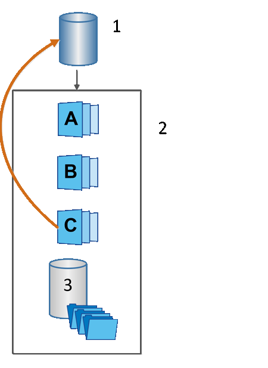

= Snapshot回滚
:allow-uri-read: 
:icons: font
:imagesdir: ../media/

[role="lead"]
回滚操作会将基础卷返回到先前的状态、此状态由选定快照决定。

对于回滚、您可以从以下任一源选择快照映像：

* *快照映像回滚*、用于完全还原基础卷。
* * Snapshot一致性组回滚*、可用于回滚一个或多个卷。

回滚期间、Snapshot功能会保留组中的所有快照映像。此外、如果I/O操作需要、还允许主机在此过程中访问基础卷。

启动回滚后、后台进程会扫描基础卷的逻辑块地址(Logical Block Address、LBA)、然后在要还原的回滚快照映像中查找写时复制数据。由于基础卷可通过主机访问进行读取和写入、并且所有先前写入的数据均可立即使用、因此预留容量卷必须足够大、以便在回滚过程中包含所有更改。数据传输将作为后台操作继续进行、直到回滚完成。

^1^基本卷；^2^组中的Snapshot对象；^3^ Snapshot组预留容量
